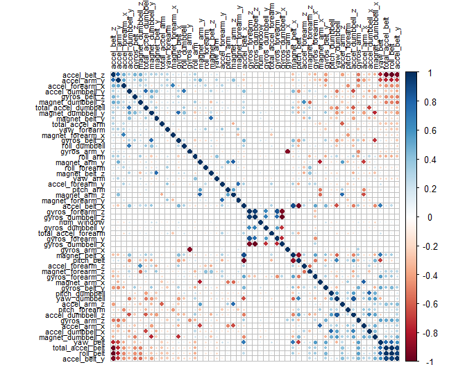
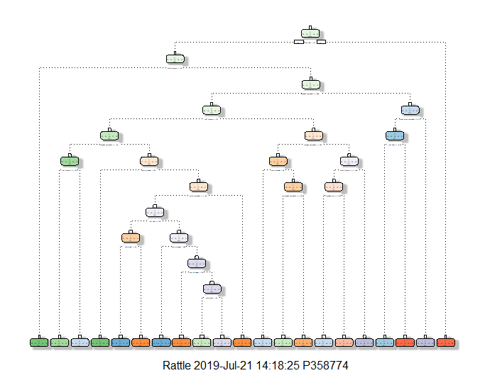

# Prediction Assignment Writeup 

## 1 Assignment 
Using devices such as Jawbone Up, Nike FuelBand, and Fitbit it is now possible to collect a large amount of data about personal activity relatively inexpensively. These type of devices are part of the quantified self movement - a group of enthusiasts who take measurements about themselves regularly to improve their health, to find patterns in their behavior, or because they are tech geeks. One thing that people regularly do is quantify how much of a particular activity they do, but they rarely quantify how well they do it. In this project, your goal will be to use data from accelerometers on the belt, forearm, arm, and dumbell of 6 participants. They were asked to perform barbell lifts correctly and incorrectly in 5 different ways. More information is available from the website here: http://web.archive.org/web/20161224072740/http:/groupware.les.inf.puc-rio.br/har (see the section on the Weight Lifting Exercise Dataset).

Data

The training data for this project are available here:

https://d396qusza40orc.cloudfront.net/predmachlearn/pml-training.csv

The test data are available here:

https://d396qusza40orc.cloudfront.net/predmachlearn/pml-testing.csv

The data for this project come from this source: http://web.archive.org/web/20161224072740/http:/groupware.les.inf.puc-rio.br/har. If you use the document you create for this class for any purpose please cite them as they have been very generous in allowing their data to be used for this kind of assignment.


## 2 Loading and cleaning the data set
We first set the working directory and load the required R packages

```r
setwd("C:/Users/P358774/Coursera/Prediction Assignment")

library(lattice)
library(ggplot2)
library(caret)
library(rpart)
library(rpart.plot)
library(corrplot)
library(rattle)
library(randomForest)
library(RColorBrewer)
library(e1071)
library(gbm)

set.seed(100)
```

```r
Loaded gbm 2.1.5
Warning message:
package 'gbm' was built under R version 3.6.1
```

The next step is to load the data from the source stated above and to split the training data set into two parts (75% for creating the models, 25% for validation). The testing data set is not touched and will only be used to generate the answers for the quiz. 

```r
url_train <- "http://d396qusza40orc.cloudfront.net/predmachlearn/pml-training.csv"
url_quiz  <- "http://d396qusza40orc.cloudfront.net/predmachlearn/pml-testing.csv"

data_train <- read.csv(url(url_train), strip.white = TRUE, na.strings = c("NA",""))
data_quiz  <- read.csv(url(url_quiz),  strip.white = TRUE, na.strings = c("NA",""))

in_train  <- createDataPartition(data_train$classe, p=0.75, list=FALSE)
train_set <- data_train[ in_train, ]
test_set  <- data_train[-in_train, ]
dim(train_set)
```

```r
[1] 14718   160
```

```r
dim(test_set)
```

```r
[1] 4904  160
```

The data sets have 160 variables (columns). The first step is to use the function nearZeroVar to identify Near Zero Variance predictors and to remove them.

```r
nzv_var <- nearZeroVar(train_set)
train_set <- train_set[ , -nzv_var]
test_set  <- test_set [ , -nzv_var]
dim(train_set)
```

```r
[1] 14718   120


```r
dim(test_set)
```

```r
[1] 4904  120
```

The second step is to remove variables which are mostly NAs (threshold = 0.95).

```r
na_var <- sapply(train_set, function(x) mean(is.na(x))) > 0.95
train_set <- train_set[ , na_var == FALSE]
test_set  <- test_set [ , na_var == FALSE]
dim(train_set)
```

```r
[1] 14718    59
```

```
dim(test_set)
```

```r
[1] 4904   59
``` 

The last step is to remove the columns which are only used for identification (1-5).

```r
train_set <- train_set[ , -(1:5)]
test_set  <- test_set [ , -(1:5)]
dim(train_set)
```

```r
[1] 14718    54
```

```r
dim(test_set)
```

```r
[1] 4904   54
```

## 3 Correlation analysis

In order to understand the relation between the varibales better, a correlation analysis is performed. The method is circle (standard) and for order FPC (first principal component) is chosen. 

```r
corr_matrix <- cor(train_set[ , -54])
corrplot(corr_matrix, order = "FPC", method = "circle", type = "full",
         tl.cex = 0.7, tl.col = rgb(0, 0, 0))
```



Dark blue (positive correlation) and dark red (negative correlation) points to the degree of correlation. One can see that not many variables are strongly correlated. With a Principal Components Analysis the numbers of variables could be reduced further. However, this is most beneficial when you have many correlated variabes. In this case this is not very beneficial. 

## 4 Model building

Three methods for model building are used: Decision Tree Model, Generalized Boosted Model and Random Forest Model. The best model (highest accuracy on test dataset) will be used for the quiz set. 

### 4.1 Decision Tree Model

```r
set.seed(100)
fit_decision_tree <- rpart(classe ~ ., data = train_set, method="class")
fancyRpartPlot(fit_decision_tree)
```



Application of the Decision Tree Model to the validation set:

```r 
predict_decision_tree <- predict(fit_decision_tree, newdata = test_set, type="class")
conf_matrix_decision_tree <- confusionMatrix(predict_decision_tree, test_set$classe)
conf_matrix_decision_tree
```

```r
Confusion Matrix and Statistics

          Reference
Prediction    A    B    C    D    E
         A 1240  184   58   66   55
         B   62  566   51   80  100
         C    5   46  687  117   58
         D   68  118   39  512  108
         E   20   35   20   29  580

Overall Statistics
                                          
               Accuracy : 0.731           
                 95% CI : (0.7184, 0.7434)
    No Information Rate : 0.2845          
    P-Value [Acc > NIR] : < 2.2e-16       
                                          
                  Kappa : 0.6581          
                                          
 Mcnemar's Test P-Value : < 2.2e-16       

Statistics by Class:

                     Class: A Class: B Class: C Class: D Class: E
Sensitivity            0.8889   0.5964   0.8035   0.6368   0.6437
Specificity            0.8966   0.9259   0.9442   0.9188   0.9740
Pos Pred Value         0.7735   0.6589   0.7525   0.6059   0.8480
Neg Pred Value         0.9530   0.9053   0.9579   0.9281   0.9239
Prevalence             0.2845   0.1935   0.1743   0.1639   0.1837
Detection Rate         0.2529   0.1154   0.1401   0.1044   0.1183
Detection Prevalence   0.3269   0.1752   0.1862   0.1723   0.1395
Balanced Accuracy      0.8927   0.7612   0.8738   0.7778   0.8089
```

The prediction accuracy is 0.73 and the plot is generated below.

```r
plot(conf_matrix_decision_tree$table, col = conf_matrix_decision_tree$byClass, 
     main = paste("Decision Tree Model - Accuracy =",
                  round(conf_matrix_decision_tree$overall['Accuracy'], 3)))
```


### 4.2 Generalized Boosted Model

First step is to fit the model:

```r
set.seed(100)
ctrl_GBM <- trainControl(method = "repeatedcv", number = 5, repeats = 1)
fit_GBM  <- train(classe ~ ., data = train_set, method = "gbm",
                  trControl = ctrl_GBM, verbose = FALSE)
fit_GBM$finalModel
```

```r 
A gradient boosted model with multinomial loss function.
150 iterations were performed.
There were 53 predictors of which 53 had non-zero influence.
```

And then predict the test set:

```r
predict_GBM <- predict(fit_GBM, newdata = test_set)
conf_matrix_GBM <- confusionMatrix(predict_GBM, test_set$classe)
conf_matrix_GBM
```

```r
Confusion Matrix and Statistics

          Reference
Prediction    A    B    C    D    E
         A 1394    8    0    0    0
         B    1  934    5    1    1
         C    0    7  849    6    3
         D    0    0    0  796    4
         E    0    0    1    1  893

Overall Statistics
                                          
               Accuracy : 0.9923          
                 95% CI : (0.9894, 0.9945)
    No Information Rate : 0.2845          
    P-Value [Acc > NIR] : < 2.2e-16       
                                          
                  Kappa : 0.9902          
                                          
 Mcnemar's Test P-Value : NA              

Statistics by Class:

                     Class: A Class: B Class: C Class: D Class: E
Sensitivity            0.9993   0.9842   0.9930   0.9900   0.9911
Specificity            0.9977   0.9980   0.9960   0.9990   0.9995
Pos Pred Value         0.9943   0.9915   0.9815   0.9950   0.9978
Neg Pred Value         0.9997   0.9962   0.9985   0.9981   0.9980
Prevalence             0.2845   0.1935   0.1743   0.1639   0.1837
Detection Rate         0.2843   0.1905   0.1731   0.1623   0.1821
Detection Prevalence   0.2859   0.1921   0.1764   0.1631   0.1825
Balanced Accuracy      0.9985   0.9911   0.9945   0.9945   0.9953
```

The accuracy is with 0.99 very high. The model could be already used to predict the quiz set. The plot of the matrix is shown below.

```r 
plot(conf_matrix_GBM$table, col = conf_matrix_GBM$byClass, 
     main = paste("Generalized Boosted Model - Accuracy =", round(conf_matrix_GBM$overall['Accuracy'], 3)))
```


     
     


### 4.3 Random Forest Model

## 5 Applying Random Forest to quiz data